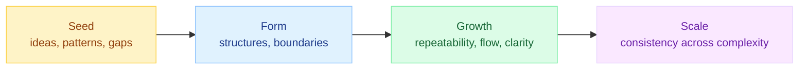
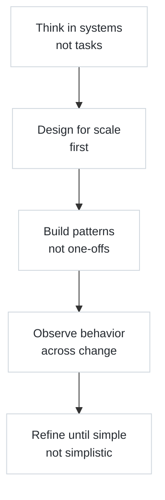

# cer4sco

I am obsessed with scaling — building distributed systems where automation is foundational and global operation is the default. Not automation for automation's sake, but the kind of scale where systems grow, evolve, and stay understandable.

I design things so they **expand cleanly**, **behave predictably**, and **stay explainable** no matter how big they get.

---

## How My Brain Works

This loop defines how I build anything.  
I start with the seed, shape the structure, let it grow, and then refine it so it scales.

---

## What I Love Building

- systems that stay clean no matter how large they become  
- workflows that feel natural even as teams grow  
- mental models that reduce chaos  
- diagrams that reveal the underlying structure  
- architectures that explain themselves  
- environments that encourage clarity, not complexity  

---

## My Style

I build with the future in mind.  
Because things never stay small.

---

## What Shapes Me

- nearly 20 years across cloud, security, platforms, creative technology  
- always taking the long view: what happens when this is 10x bigger?  
- influenced by art, game engines, and architecture  
- obsessed with patterns, flow, and structure  

---

## Focus Right Now

- designing scaling-first governance models  
- new ways to visualize cloud and system behavior  
- frameworks that eliminate friction at growth boundaries  
- blending creative thinking with engineering precision  

---

## Find Me

https://linkedin.com/in/cer4sco